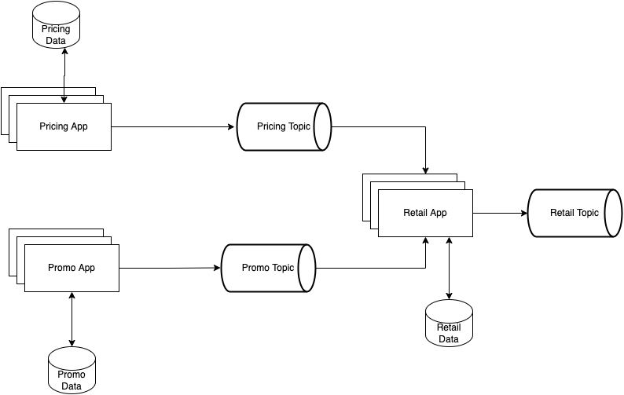

# Retail App
Simple app to demonstrate even-driven architecture where we combine data from two microservices pricing and promo app
to give the final output of retail price of the product.

# Steps to start the application
1. Install Docker
2. docker compose up -d
   This will pull following docker images:
    * Kafka
    * MongoDB
    * Mongo Express (To access mongoDB, go to url: http://localhost:8081/)

# Pricing Database
TODO

# Promo Database
TODO

# Steps to Stop the application
1. docker compose down